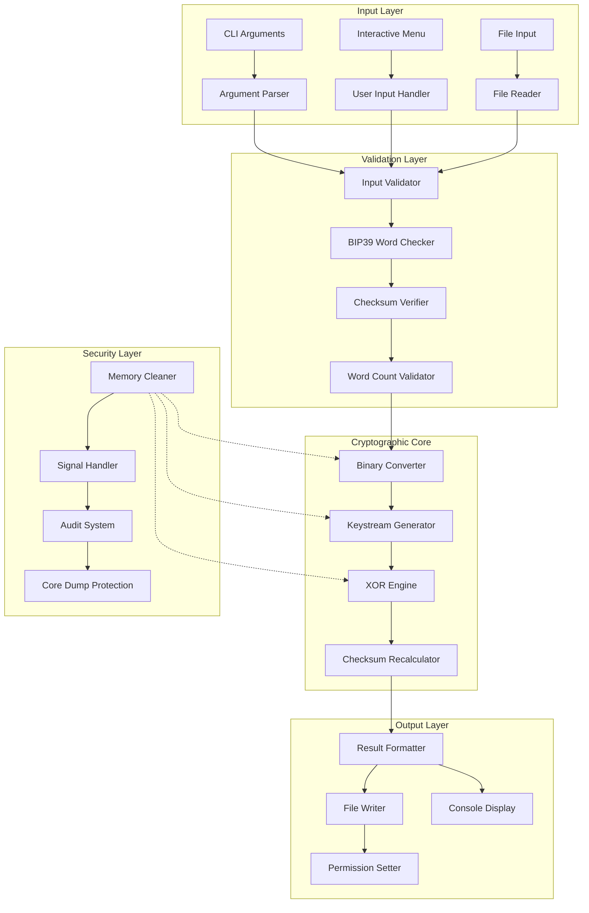
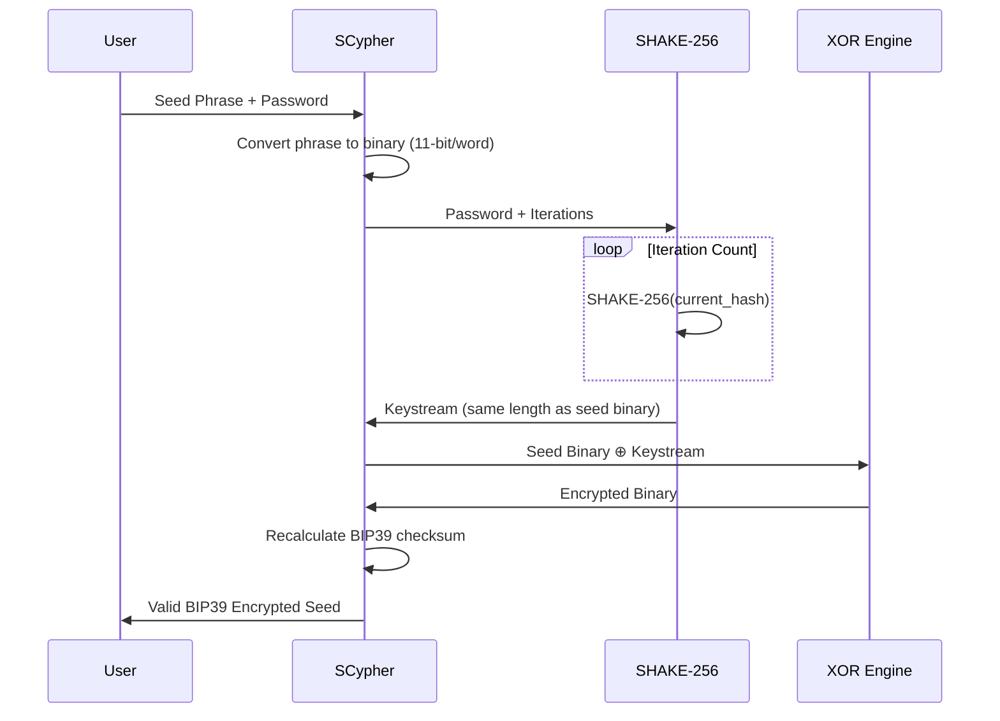
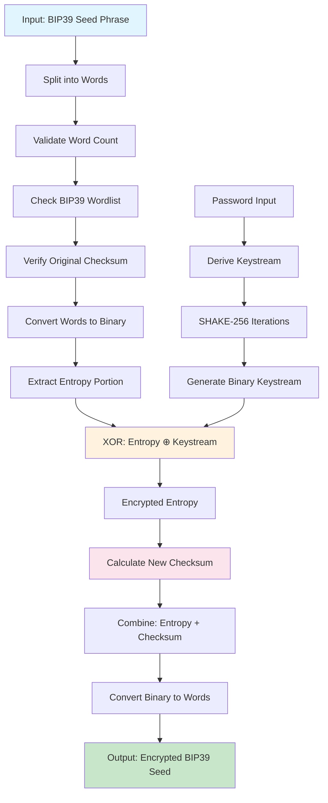
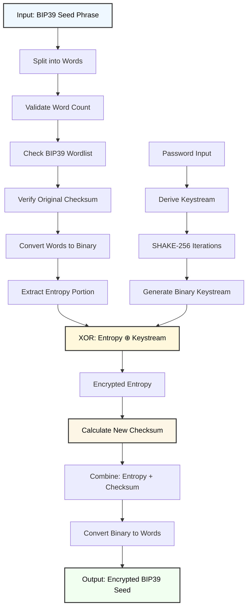
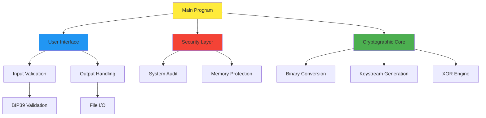

# SCypher v2.0 - Technical Documentation
## XOR-based BIP39 Seed Cipher - Implementation Guide

**Version:** 2.0-ErgoHack-X  
**Target Audience:** Developers, Security Researchers, Advanced Users  
**License:** MIT License

---

## Table of Contents

1. [Architecture Overview](#architecture-overview)
2. [Cryptographic Implementation](#cryptographic-implementation)
3. [Core Function Analysis](#core-function-analysis)
4. [Data Flow Diagrams](#data-flow-diagrams)
5. [Security Analysis](#security-analysis)
6. [Performance Characteristics](#performance-characteristics)
7. [Code Structure & Modules](#code-structure--modules)
8. [Testing & Validation](#testing--validation)
9. [API Reference](#api-reference)
10. [Extension Guidelines](#extension-guidelines)

---

## Architecture Overview

### System Architecture



### Component Responsibilities

| Component | Purpose | Key Functions |
|-----------|---------|---------------|
| **Input Layer** | User interface and data ingestion | CLI parsing, menu system, file I/O |
| **Validation Layer** | Data integrity and format verification | BIP39 compliance, checksum validation |
| **Cryptographic Core** | Encryption/decryption operations | XOR cipher, keystream generation |
| **Output Layer** | Result formatting and delivery | File writing, console output |
| **Security Layer** | System hardening and cleanup | Memory management, audit logging |

---

## Cryptographic Implementation

### XOR Cipher with SHAKE-256 Keystream

The core cryptographic operation combines XOR cipher with SHAKE-256 for keystream generation:



### Mathematical Foundation

**XOR Operation:**
```
For binary strings A and B of equal length n:
C[i] = A[i] ⊕ B[i] for i ∈ [0, n-1]

Where ⊕ is the exclusive OR operation:
0 ⊕ 0 = 0
0 ⊕ 1 = 1  
1 ⊕ 0 = 1
1 ⊕ 1 = 0
```

**Keystream Generation:**
```
K₀ = SHAKE-256(password)
K₁ = SHAKE-256(K₀)
...
Kᵢ = SHAKE-256(Kᵢ₋₁)

Final_Keystream = Kᵢₜₑᵣₐₜᵢₒₙₛ[0:seed_bit_length]
```

**Security Properties:**
- **Perfect Secrecy**: When keystream is truly random and used only once
- **Symmetry**: Encryption and decryption use identical operations
- **Determinism**: Same inputs always produce same outputs

---

## Core Function Analysis

### 1. Binary Conversion Functions

**`words_to_bits()`**
```bash
# Purpose: Convert BIP39 words to binary representation
# Input: Space-separated string of BIP39 words
# Output: Binary string (11 bits per word)
# Complexity: O(n) where n = number of words

words_to_bits() {
    local input="$1"
    local -a words
    read -ra words <<< "$input"
    local binary=""

    for word in "${words[@]}"; do
        local index=0
        # Find word index in WORDS array
        for ((i=0; i<${#WORDS[@]}; i++)); do
            if [[ "${WORDS[$i]}" == "$word" ]]; then
                index=$i
                break
            fi
        done
        # Convert to 11-bit binary
        local bin=$(decimal_to_binary "$index" 11)
        binary+="$bin"
    done

    echo "$binary"
}
```

**Key Implementation Details:**
- Uses linear search through WORDS array (2048 entries)
- Each word maps to 11-bit binary (2¹¹ = 2048 possible values)
- Concatenates all word binaries to form complete seed binary

**`bits_to_words()`**
```bash
# Purpose: Convert binary string back to BIP39 words
# Input: Binary string  
# Output: Space-separated BIP39 words
# Complexity: O(n/11) where n = binary length

bits_to_words() {
    local binary="$1"
    local phrase=""

    # Process 11 bits at a time
    for ((i = 0; i < ${#binary}; i += 11)); do
        local chunk="${binary:i:11}"
        if [[ ${#chunk} -eq 11 ]]; then
            local index=$(binary_to_decimal "$chunk")
            [[ -n "$phrase" ]] && phrase+=" "
            phrase+="${WORDS[$index]}"
        fi
    done

    echo "$phrase"
}
```

### 2. Keystream Generation

**`derive_keystream()`**
```bash
# Purpose: Generate cryptographic keystream using SHAKE-256
# Input: password, bit_length, iterations
# Output: Binary keystream of specified length
# Security: Uses iterative hashing for key strengthening

derive_keystream() {
    local password="$1"
    local bit_length="$2"
    local iterations="$3"
    local byte_length=$(( (bit_length + 7) / 8 ))

    # Initial hash
    local current_hash="$password"

    # Apply iterations for key strengthening
    for ((i = 1; i <= iterations; i++)); do
        current_hash=$(echo -n "$current_hash" | openssl dgst -shake256 -xoflen "$byte_length" | sed 's/^.*= //')
    done

    # Convert hex to binary
    local binary=""
    for ((i = 0; i < ${#current_hash}; i += 2)); do
        local hex_byte="${current_hash:i:2}"
        local dec=$((16#$hex_byte))
        local bin=$(decimal_to_binary "$dec" 8)
        binary+="$bin"
    done

    echo "${binary:0:$bit_length}"
}
```

**Security Analysis:**
- **SHAKE-256**: Cryptographically secure hash function
- **Iterative Strengthening**: Increases computational cost for brute force attacks
- **Variable Output Length**: Generates exactly required keystream length
- **Hex-to-Binary Conversion**: Native Bash arithmetic for efficiency

### 3. XOR Engine

**`xor_bits()`**
```bash
# Purpose: Perform bitwise XOR operation
# Input: Two binary strings of equal length
# Output: XOR result as binary string
# Complexity: O(n) where n = string length

xor_bits() {
    local a="$1"
    local b="$2"
    local result=""

    for ((i = 0; i < ${#a}; i++)); do
        local bit_a="${a:i:1}"
        local bit_b="${b:i:1}"
        result+=$((bit_a ^ bit_b))
    done

    echo "$result"
}
```

**Performance Optimization:**
- Character-by-character processing for memory efficiency
- Native Bash XOR operator (`^`) for maximum compatibility
- Single-pass algorithm minimizes memory usage

### 4. Checksum Management

**`calculate_checksum_bits()`**
```bash
# Purpose: Calculate BIP39 checksum for entropy
# Input: Binary entropy string
# Output: Checksum bits according to BIP39 standard
# Standard: Checksum_length = entropy_length / 32

calculate_checksum_bits() {
    local entropy="$1"
    local entropy_bits=${#entropy}
    local checksum_bits=$((entropy_bits / 32))

    # Convert binary to bytes for SHA256 hashing
    local binary_data=""
    for ((i = 0; i < entropy_bits; i += 8)); do
        local byte="${entropy:i:8}"
        # Pad byte if necessary
        while [[ ${#byte} -lt 8 ]]; do
            byte+="0"
        done
        
        local decimal_value=$(binary_to_decimal "$byte")
        local hex_value=$(printf "%02x" $decimal_value)
        binary_data+="\\x$hex_value"
    done

    # Calculate SHA256 hash
    local hash_output=$(echo -e -n "$binary_data" | openssl dgst -sha256)
    local hash_hex="${hash_output##*= }"

    # Extract required checksum bits from hash
    local checksum_binary=""
    local bits_needed=$checksum_bits
    local hex_pos=0

    while [[ $bits_needed -gt 0 && $hex_pos -lt ${#hash_hex} ]]; do
        local hex_char="${hash_hex:$hex_pos:1}"
        # Convert hex to binary and take needed bits
        case "$hex_char" in
            "0") hex_nibble="0000" ;;
            "1") hex_nibble="0001" ;;
            # ... (complete hex-to-binary mapping)
            "f"|"F") hex_nibble="1111" ;;
        esac
        
        if [[ $bits_needed -ge 4 ]]; then
            checksum_binary+="$hex_nibble"
            bits_needed=$((bits_needed - 4))
        else
            checksum_binary+="${hex_nibble:0:$bits_needed}"
            bits_needed=0
        fi
        hex_pos=$((hex_pos + 1))
    done

    echo "$checksum_binary"
}
```

---

## Data Flow Diagrams

### Complete Processing Pipeline



## Data Flow Diagrams

### Complete Processing Pipeline



### Memory Management Flow


---

## Security Analysis

### Threat Model

**Assets to Protect:**
- Original seed phrases
- User passwords
- Intermediate cryptographic values
- Processing metadata

**Threat Vectors:**
1. **Memory Dumps**: Core dumps could expose sensitive data
2. **Command History**: Shell history might contain passwords
3. **Process Analysis**: Runtime analysis could extract keys
4. **Side-Channel Attacks**: Timing or power analysis
5. **Implementation Flaws**: Bugs in cryptographic functions

### Security Mitigations

**Memory Protection:**
```bash
# Core dump protection
protect_against_coredumps() {
    ulimit -c 0 2>/dev/null
    if command -v prctl >/dev/null 2>&1; then
        prctl --set-priv basic,!core_dump $ >/dev/null 2>&1
    fi
}

# Secure cleanup
cleanup() {
    # Overwrite sensitive variables with random data
    for var in "${sensitive_vars[@]}"; do
        if [[ -n "${!var:-}" ]]; then
            local random_pattern=$(tr -dc 'A-Za-z0-9' < /dev/urandom | head -c 32)
            printf -v "$var" "%s" "$random_pattern"
            printf -v "$var" "%s" ""
        fi
    done
    
    # Clear command history
    history -c && history -w
    
    # Clean file descriptors
    exec 3>&- 2>/dev/null
}
```

**Input Validation:**
- **Character Set Restrictions**: Only alphanumeric characters allowed in input
- **Length Limits**: Prevents buffer overflow attacks
- **BIP39 Compliance**: Ensures all words are from standard wordlist
- **Checksum Verification**: Validates input integrity

**System Hardening:**
```bash
# Environment security audit
system_security_audit() {
    check_system_memory()        # Verify adequate RAM
    validate_openssl_security()  # Ensure SHAKE-256 support
    audit_environment_variables() # Check for security risks
    verify_path_security()       # Validate PATH integrity
    validate_system_config()     # Check locale and IFS
}
```

### Cryptographic Security Assessment

**Strength Analysis:**

| Component | Security Level | Notes |
|-----------|----------------|--------|
| **XOR Cipher** | Perfect Secrecy¹ | When keystream is truly random |
| **SHAKE-256** | 256-bit security | Cryptographically secure PRF |
| **Key Derivation** | Configurable | Depends on iteration count |
| **BIP39 Compliance** | Standard | Maintains ecosystem compatibility |

¹ *Theoretical perfect secrecy requires truly random keystream used only once*

**Vulnerability Assessment:**

**Low Risk:**
- Dictionary attacks (mitigated by iteration count)
- Brute force on weak passwords (user education required)

**Medium Risk:**
- Implementation bugs in binary conversion
- Side-channel attacks during processing

**High Risk:**
- Password reuse across multiple seeds
- Insufficient iterations for high-value applications
- Memory dumps on compromised systems

---

## Performance Characteristics

### Computational Complexity

**Time Complexity Analysis:**

| Function | Complexity | Notes |
|----------|------------|--------|
| `words_to_bits()` | O(n×m) | n=words, m=wordlist size (2048) |
| `derive_keystream()` | O(i×h) | i=iterations, h=hash time |
| `xor_bits()` | O(n) | n=binary string length |
| `calculate_checksum_bits()` | O(n) | n=entropy bits |
| `bits_to_words()` | O(n/11) | n=binary length |

**Space Complexity:**
- **Input Storage**: O(n) for n-word seed phrases
- **Binary Representation**: O(11n) bits for n words
- **Keystream Buffer**: O(11n) bits matching seed length
- **Temporary Variables**: O(1) constant overhead

### Performance Benchmarks

**Typical Processing Times** (on modern hardware):

```mermaid
gantt
    title Processing Time vs Iterations (12-word seed)
    dateFormat X
    axisFormat %s
    
    section 1K Iterations
    Processing    :0, 100
    
    section 10K Iterations  
    Processing    :0, 500
    
    section 100K Iterations
    Processing    :0, 2000
    
    section 1M Iterations
    Processing    :0, 15000
```



**Memory Usage:**
- **Base Memory**: ~50MB for script and wordlist
- **Processing Peak**: ~100MB during XOR operations
- **Cleanup**: Returns to ~10MB after processing

### Optimization Strategies

**Current Optimizations:**
1. **Native Bash Arithmetic**: Avoids external process calls
2. **Single-Pass Processing**: Minimizes memory allocation
3. **Efficient Binary Conversion**: Direct bit manipulation
4. **Lazy Evaluation**: Only processes required data

**Potential Improvements:**
1. **Wordlist Hash Table**: O(1) word lookup vs O(n) search
2. **Parallel Processing**: Multi-core keystream generation
3. **Memory Mapping**: Reduce memory copies
4. **Assembly Optimizations**: Critical path optimization

---

## Code Structure & Modules

### File Organization

```
SCypherV2.sh
├── Header & License Information
├── System Requirements & Dependencies
├── Global Constants & Configuration
├── BIP39 Wordlist (2048 words)
├── Security & Audit Functions
├── Input/Output Handling
├── Cryptographic Core Functions
├── User Interface & Menu System
├── Cleanup & Signal Handling
└── Main Program Logic
```

### Function Categories

**Security Layer (17 functions):**
```bash
system_security_audit()         # Main security audit
verify_basic_requirements()     # Check root privileges
check_system_memory()          # Memory availability
validate_openssl_security()    # OpenSSL validation
audit_environment_variables()  # Environment security
verify_path_security()         # PATH validation
protect_against_coredumps()    # Core dump protection
secure_input_mode()            # Terminal security
setup_signal_handlers()        # Signal management
cleanup()                      # Memory cleanup
add_audit_message()            # Audit logging
initialize_audit()             # Audit initialization
```

**User Interface (12 functions):**
```bash
show_main_menu()               # Main menu display
show_help_submenu()            # Help menu
show_usage_examples()          # Usage examples
handle_main_menu()             # Menu navigation
handle_help_submenu()          # Help navigation
handle_post_processing_menu()  # Post-op menu
handle_save_result()           # File saving
clear_screen()                 # Screen clearing
show_license()                 # License display
show_details()                 # Technical details
show_usage()                   # Usage information
```

**Cryptographic Core (8 functions):**
```bash
process_phrase_xor()           # Main XOR processor
derive_keystream()             # SHAKE-256 keystream
xor_bits()                     # XOR operation
words_to_bits()                # Word-to-binary conversion
bits_to_words()                # Binary-to-word conversion
calculate_checksum_bits()      # BIP39 checksum
recalculate_bip39_checksum()   # Checksum recalculation
verify_checksum()              # Checksum validation
```

**Input/Output (6 functions):**
```bash
read_secure_password()         # Secure password input
read_password_with_asterisks() # Visual password feedback
read_words_from_file()         # File input handling
validate_output_file()         # Output file validation
handle_error()                 # Error handling
validate_input()               # Input validation
```

**Validation Layer (4 functions):**
```bash
validate_word_count()          # Word count validation
validate_bip39_words()         # BIP39 wordlist check
decimal_to_binary()            # Number base conversion
binary_to_decimal()            # Binary conversion
```

### Module Dependencies



---

## Testing & Validation

### Test Coverage Strategy

**Unit Testing:**
```bash
# Test binary conversion accuracy
test_binary_conversion() {
    local test_word="abandon"  # Index 0 in BIP39
    local expected_binary="00000000000"
    local actual_binary=$(words_to_bits "$test_word")
    [[ "$actual_binary" == "$expected_binary" ]] || echo "FAIL: Binary conversion"
}

# Test XOR symmetry
test_xor_symmetry() {
    local original="101010101010"
    local key="110011001100"
    local encrypted=$(xor_bits "$original" "$key")
    local decrypted=$(xor_bits "$encrypted" "$key")
    [[ "$original" == "$decrypted" ]] || echo "FAIL: XOR symmetry"
}

# Test checksum calculation
test_checksum_calculation() {
    local entropy="10101010101010101010101010101010"
    local checksum=$(calculate_checksum_bits "$entropy")
    # Verify checksum length: entropy_bits / 32
    local expected_length=$((${#entropy} / 32))
    [[ ${#checksum} -eq $expected_length ]] || echo "FAIL: Checksum length"
}
```

**Integration Testing:**
```bash
# Test complete encryption/decryption cycle
test_full_cycle() {
    local original_seed="abandon abandon abandon abandon abandon abandon abandon abandon abandon abandon abandon about"
    local password="test_password_123"
    local iterations=1000
    
    # Encrypt
    local encrypted=$(process_phrase_xor "$original_seed" "$password" "$iterations")
    
    # Decrypt
    local decrypted=$(process_phrase_xor "$encrypted" "$password" "$iterations")
    
    [[ "$original_seed" == "$decrypted" ]] || echo "FAIL: Full cycle test"
}
```

**Security Testing:**
```bash
# Test memory cleanup
test_memory_cleanup() {
    local sensitive_var="secret_data_123"
    cleanup
    # Verify variable is cleared
    [[ -z "${sensitive_var:-}" ]] || echo "FAIL: Memory not cleaned"
}

# Test input validation
test_input_validation() {
    local invalid_input="invalid@#$%characters"
    validate_input "$invalid_input" && echo "FAIL: Invalid input accepted"
}
```

### Validation Procedures

**BIP39 Compliance Validation:**
1. **Word Count Check**: Verify 12/15/18/21/24 word phrases
2. **Wordlist Validation**: Confirm all words exist in BIP39 standard
3. **Checksum Verification**: Validate input and output checksums
4. **Cross-Wallet Testing**: Test outputs in multiple BIP39 wallets

**Cryptographic Validation:**
1. **Keystream Quality**: Statistical randomness tests
2. **XOR Correctness**: Symmetry and bit-level accuracy
3. **Iteration Consistency**: Same inputs produce same outputs
4. **Edge Case Handling**: Boundary conditions and error states

---

## API Reference

### Core Functions

#### `process_phrase_xor(phrase, password, iterations)`
**Purpose:** Main encryption/decryption function
**Parameters:**
- `phrase` (string): BIP39 seed phrase (space-separated)
- `password` (string): User password for keystream generation
- `iterations` (integer): Number of SHAKE-256 iterations

**Returns:** Encrypted/decrypted BIP39 seed phrase
**Example:**
```bash
result=$(process_phrase_xor "word1 word2 ... word12" "mypassword" 1000)
```

#### `derive_keystream(password, bit_length, iterations)`
**Purpose:** Generate cryptographic keystream
**Parameters:**
- `password` (string): Source password
- `bit_length` (integer): Required keystream length in bits
- `iterations` (integer): Hash iteration count

**Returns:** Binary keystream string
**Example:**
```bash
keystream=$(derive_keystream "password123" 132 1000)
```

#### `words_to_bits(word_string)`
**Purpose:** Convert BIP39 words to binary representation
**Parameters:**
- `word_string` (string): Space-separated BIP39 words

**Returns:** Binary string (11 bits per word)
**Example:**
```bash
binary=$(words_to_bits "abandon ability able")
# Returns: "000000000000000000010000000000010"
```

#### `bits_to_words(binary_string)`
**Purpose:** Convert binary to BIP39 words
**Parameters:**
- `binary_string` (string): Binary representation

**Returns:** Space-separated BIP39 words
**Example:**
```bash
words=$(bits_to_words "000000000000000000010000000000010")
# Returns: "abandon ability able"
```

#### `calculate_checksum_bits(entropy)`
**Purpose:** Calculate BIP39 checksum for entropy
**Parameters:**
- `entropy` (string): Binary entropy string

**Returns:** Checksum bits according to BIP39 standard
**Example:**
```bash
checksum=$(calculate_checksum_bits "10101010...")
```

### Validation Functions

#### `validate_bip39_words(word_array)`
**Purpose:** Verify all words exist in BIP39 wordlist
**Parameters:**
- `word_array` (array): Array of words to validate

**Returns:** 0 if valid, 1 if invalid
**Example:**
```bash
words=("abandon" "ability" "able")
validate_bip39_words "${words[@]}" || echo "Invalid words found"
```

#### `verify_checksum(seed_phrase)`
**Purpose:** Verify BIP39 checksum validity
**Parameters:**
- `seed_phrase` (string): Complete seed phrase

**Returns:** 0 if valid, 1 if invalid
**Example:**
```bash
verify_checksum "abandon abandon ... about" && echo "Valid checksum"
```

### Utility Functions

#### `decimal_to_binary(decimal, width)`
**Purpose:** Convert decimal to binary with specified width
**Parameters:**
- `decimal` (integer): Decimal number to convert
- `width` (integer): Target binary width (optional, default 8)

**Returns:** Binary string with leading zeros
**Example:**
```bash
binary=$(decimal_to_binary 42 8)
# Returns: "00101010"
```

#### `binary_to_decimal(binary_string)`
**Purpose:** Convert binary string to decimal
**Parameters:**
- `binary_string` (string): Binary representation

**Returns:** Decimal number
**Example:**
```bash
decimal=$(binary_to_decimal "00101010")
# Returns: "42"
```

---

## Extension Guidelines

### Adding New Cryptographic Functions

**Template for New Hash Functions:**
```bash
# Template for adding new hash function support
derive_keystream_new_hash() {
    local password="$1"
    local bit_length="$2"
    local iterations="$3"
    local hash_function="$4"  # e.g., "sha3-256", "blake2b"
    
    # Validate hash function availability
    if ! echo "test" | openssl dgst -"$hash_function" >/dev/null 2>&1; then
        echo "Error: Hash function $hash_function not available" >&2
        return 1
    fi
    
    # Implementation follows same pattern as derive_keystream()
    # with hash_function parameter
}
```

### Custom Word Lists

**Adding Alternative Wordlists:**
```bash
# Template for alternative wordlist support
declare -ra CUSTOM_WORDS=(
    # Your custom 2048-word list here
    # Must maintain 11-bit addressing (2^11 = 2048)
)

validate_custom_words() {
    local -a words=("$@")
    declare -A word_lookup
    
    # Build lookup table for custom wordlist
    for word in "${CUSTOM_WORDS[@]}"; do
        word_lookup["$word"]=1
    done
    
    # Validation logic (same as validate_bip39_words)
}
```

### Performance Optimizations

**Wordlist Hash Table Implementation:**
```bash
# Optimize word-to-index lookup from O(n) to O(1)
declare -A WORD_INDEX_MAP

build_word_index_map() {
    for ((i=0; i<${#WORDS[@]}; i++)); do
        WORD_INDEX_MAP["${WORDS[$i]}"]=$i
    done
}

optimized_words_to_bits() {
    local input="$1"
    local -a words
    read -ra words <<< "$input"
    local binary=""

    for word in "${words[@]}"; do
        local index="${WORD_INDEX_MAP[$word]}"
        local bin=$(decimal_to_binary "$index" 11)
        binary+="$bin"
    done

    echo "$binary"
}
```

### Security Enhancements

**Adding Hardware Security Module (HSM) Support:**
```bash
# Template for HSM integration
derive_keystream_hsm() {
    local password="$1"
    local bit_length="$2"
    local iterations="$3"
    local hsm_slot="$4"
    
    # Use PKCS#11 interface or hardware-specific API
    # Maintain same interface as derive_keystream()
}
```

**Additional Entropy Sources:**
```bash
# Template for additional entropy integration
enhance_keystream_entropy() {
    local base_keystream="$1"
    local additional_entropy=""
    
    # Collect additional entropy sources
    if [[ -r /dev/hwrng ]]; then
        additional_entropy+=$(dd if=/dev/hwrng bs=32 count=1 2>/dev/null | base64)
    fi
    
    # Combine entropy sources cryptographically
    local enhanced_stream=$(echo "$base_keystream$additional_entropy" | openssl dgst -shake256 -xoflen "$((${#base_keystream}/2))")
    
    echo "$enhanced_stream"
}
```

---

## Conclusion

SCypher v2.0 represents a sophisticated implementation of XOR-based encryption specifically designed for BIP39 seed phrase protection. The architecture balances security, usability, and compatibility while maintaining the critical property that all outputs remain valid BIP39 seed phrases.

### Key Architectural Decisions

1. **XOR Cipher Choice**: Provides perfect secrecy with proper keystream generation
2. **SHAKE-256 Integration**: Ensures cryptographically secure keystream derivation
3. **BIP39 Compliance**: Maintains ecosystem compatibility through checksum recalculation
4. **Bash Implementation**: Maximizes portability while minimizing dependencies
5. **Comprehensive Security**: Multi-layered protection against various attack vectors

### Development Best Practices

- **Security-First Design**: Every component considers security implications
- **Extensive Validation**: Input validation at multiple layers
- **Memory Management**: Proactive cleanup of sensitive data
- **Error Handling**: Graceful degradation and user feedback
- **Documentation**: Comprehensive inline and external documentation

### Future Enhancement Opportunities

1. **Performance Optimization**: Hash table wordlist lookup, parallel processing
2. **Hardware Integration**: HSM support, hardware random number generators
3. **Additional Algorithms**: Support for other cryptographic primitives
4. **Platform Extensions**: Native mobile and desktop applications
5. **Audit Integration**: Formal security verification and certification

This technical documentation provides the foundation for understanding, maintaining, and extending SCypher v2.0 while preserving its security properties and design principles.

---

**End of Technical Documentation**

**References:**
- [BIP39 Standard](https://github.com/bitcoin/bips/blob/master/bip-0039.mediawiki)
- [SHAKE-256 Specification](https://nvlpubs.nist.gov/nistpubs/FIPS/NIST.FIPS.202.pdf)
- [OpenSSL Documentation](https://www.openssl.org/docs/)
- [Bash Manual](https://www.gnu.org/software/bash/manual/)

**Project Links:**
- GitHub Repository: https://github.com/moon-miner/bash-BIP39-seed-cypher
- Web Demo: https://scypher.vercel.app/
