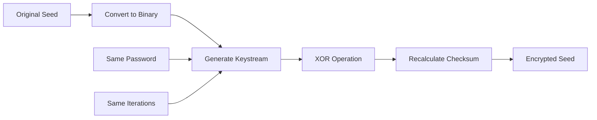
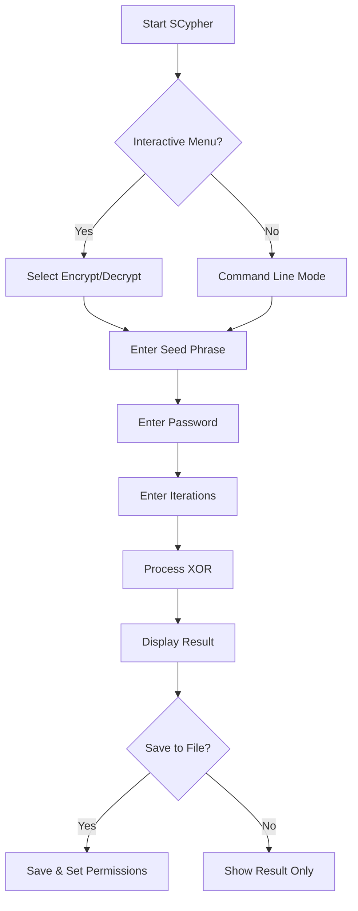
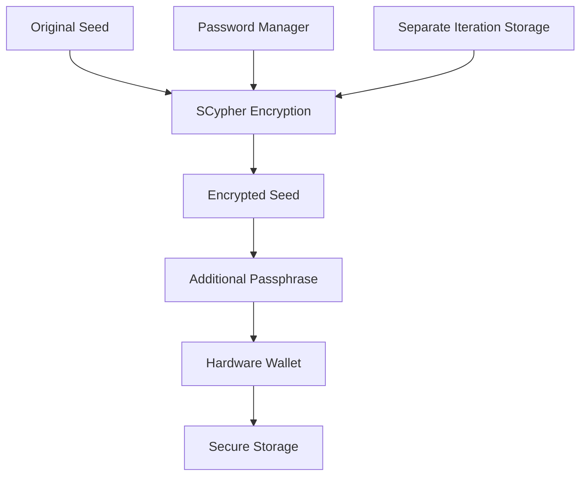

# SCypher v2.0 - User Guide
## XOR-based BIP39 Seed Cipher

**Version:** 2.0-ErgoHack-X  
**License:** MIT License  
**Development:** Based on BIP39 Standard (M. Palatinus & P. Rusnak), developed with AI assistance

---

## Table of Contents

1. [Introduction](#introduction)
2. [Security Overview](#security-overview)
3. [Installation & Requirements](#installation--requirements)
4. [Quick Start Guide](#quick-start-guide)
5. [Usage Examples](#usage-examples)
6. [Command Line Reference](#command-line-reference)
7. [Security Best Practices](#security-best-practices)
8. [Troubleshooting](#troubleshooting)
9. [FAQ](#faq)
10. [License & Disclaimer](#license--disclaimer)

---

## Introduction

SCypher v2.0 is a command-line tool that provides **reversible XOR-based encryption** for BIP39 seed phrases while maintaining full BIP39 compatibility. Unlike traditional encryption methods, SCypher ensures that both the input and output are valid BIP39 seed phrases that can be used with any compliant wallet.

### Key Features

- **XOR-based encryption** with cryptographically secure keystream generation
- **BIP39 compatibility** - all outputs are valid seed phrases
- **No salt required** - deterministic transformation based on password
- **Iterative key strengthening** for enhanced security
- **Pure Bash implementation** with minimal dependencies
- **Cross-platform compatibility** (Linux, macOS, Windows WSL)
- **Interactive and silent modes** for different use cases

### How It Works (Simple Overview)



SCypher converts your seed phrase to binary, generates a keystream from your password using SHAKE-256, performs XOR encryption, and ensures the result is a valid BIP39 phrase. The same process with the same password reverses the transformation.

---

## Security Overview

### Encryption Method
- **XOR Cipher**: Provides information-theoretic security when keystream is properly generated
- **SHAKE-256**: Cryptographically secure hash function for keystream derivation
- **Iterative Strengthening**: Multiple rounds increase computational cost for attackers
- **Deterministic**: Same input + password always produces same output

### Security Considerations

**✅ Strengths:**
- No patterns in encrypted output (appears as random BIP39 phrase)
- Symmetric operation (same process encrypts and decrypts)
- No metadata leakage
- Maintains BIP39 compatibility for plausible deniability

**⚠️ Important Notes:**
- Security depends entirely on password strength
- Password must be remembered exactly (including iterations count)
- No password recovery mechanism exists
- XOR encryption is only as secure as the keystream quality

---

## Installation & Requirements

### System Requirements

**Minimum Requirements:**
- Bash 4.0 or higher
- OpenSSL 3.0 or higher (SHAKE-256 support required)
- 100MB+ available RAM
- UTF-8 terminal support

**Operating System Support:**
- Linux (all major distributions)
- macOS (with Homebrew OpenSSL)
- Windows (WSL, Cygwin, MSYS2)

### Installation Instructions

#### Linux (Debian/Ubuntu)
```bash
# Install OpenSSL 3.0+
sudo apt-get update
sudo apt-get install openssl

# Download SCypher
wget https://github.com/moon-miner/bash-BIP39-seed-cypher/raw/main/SCypherV2.sh
chmod +x SCypherV2.sh
```

#### macOS
```bash
# Install OpenSSL 3.0+ via Homebrew
brew install openssl@3

# Download SCypher
curl -O https://github.com/moon-miner/bash-BIP39-seed-cypher/raw/main/SCypherV2.sh
chmod +x SCypherV2.sh
```

#### Windows (WSL)
```bash
# Install WSL and Ubuntu, then follow Linux instructions
wsl --install
# After WSL setup, follow Linux installation steps
```

### Verification

Test your installation:
```bash
./SCypherV2.sh --help
```

If you see the help message with ASCII art banner, installation was successful.

---

## Quick Start Guide

### Basic Usage Flow



### First Time Usage

1. **Start SCypher**:
   ```bash
   ./SCypherV2.sh
   ```

2. **Select Option 1** (Encrypt/Decrypt seed phrase)

3. **Enter your seed phrase**:
   ```
   Enter seed phrase or input file to process:
   > abandon ability able about above absent absorb abstract absurd abuse access accident
   ```

4. **Enter a strong password**:
   ```
   Enter password: ********
   Confirm password: ********
   ```

5. **Choose iterations** (higher = more secure but slower):
   ```
   Enter number of iterations (minimum 1): 1000
   ```

6. **View your encrypted seed phrase**:
   ```
   Result:
   crypto matrix future digital wallet secure random generate entropy blockchain system trust
   ```

### Decryption Process

To decrypt, simply run the same process with:
- The **encrypted seed phrase** as input
- The **same password**
- The **same number of iterations**

The output will be your original seed phrase.

---

## Usage Examples

### Interactive Mode (Recommended for Beginners)

**Basic encryption:**
```bash
./SCypherV2.sh

# Follow the menu prompts:
# 1. Select "Encrypt/Decrypt seed phrase"
# 2. Enter your seed phrase
# 3. Enter password (twice for confirmation)
# 4. Enter iteration count
# 5. View result and optionally save to file
```

### Command Line Mode

**Encrypt and save to file:**
```bash
./SCypherV2.sh -f encrypted_seed.txt
# Then follow prompts for seed phrase, password, and iterations
```

**Silent mode for scripting:**
```bash
echo "abandon ability able about above absent absorb abstract absurd abuse access accident" | \
./SCypherV2.sh -s <<< $'mySecurePassword123\n1000' > result.txt
```

**Process from input file:**
```bash
echo "abandon ability able about above absent absorb abstract absurd abuse access accident" > original.txt
./SCypherV2.sh -f encrypted.txt
# When prompted, enter: original.txt
```

### Advanced Usage Patterns

**Batch processing multiple seeds:**
```bash
#!/bin/bash
for seed_file in seeds/*.txt; do
    ./SCypherV2.sh -s -f "encrypted/$(basename "$seed_file")" < "$seed_file" <<< $'password\n1000'
done
```

**Integration with password managers:**
```bash
# Using pass (password manager)
PASS=$(pass show crypto/scypher-password)
echo "$SEED_PHRASE" | ./SCypherV2.sh -s <<< $"${PASS}\n5000"
```

---

## Command Line Reference

### Syntax
```
./SCypherV2.sh [OPTIONS]
./SCypherV2.sh [OPTIONS] < input_file
```

### Options

| Option | Description | Example |
|--------|-------------|---------|
| `-f FILE` | Save output to specified file (auto-adds .txt) | `-f backup` |
| `-s, --silent` | Silent mode (no prompts, for scripting) | `-s` |
| `--license` | Display license and disclaimer | `--license` |
| `--details` | Show detailed cipher explanation | `--details` |
| `-h, --help` | Display help message and exit | `-h` |

### Input Methods

**Direct input:**
```bash
./SCypherV2.sh
# Enter seed phrase when prompted
```

**File input:**
```bash
./SCypherV2.sh
# Enter filename when prompted: myseed.txt
```

**Pipe input (silent mode):**
```bash
cat seed.txt | ./SCypherV2.sh -s <<< $'password\n1000'
```

### Output Options

**Screen output only:**
```bash
./SCypherV2.sh
# Result displayed on screen
```

**Save to file:**
```bash
./SCypherV2.sh -f output.txt
# Result saved with 600 permissions (owner read/write only)
```

**Redirect output:**
```bash
./SCypherV2.sh -s < input.txt <<< $'pass\n1000' > output.txt
```

---

## Security Best Practices

### Password Security

**✅ Strong Password Guidelines:**
- **Minimum 12 characters** (tool enforces minimum 1, but use more)
- **Mix of uppercase, lowercase, numbers, symbols**
- **Unique password** not used elsewhere
- **Memorable but not guessable** (consider passphrases)

**Example strong passwords:**
```
MyDog$Loves2Swim!
Coffee&Code@3AM
Sunset-Beach-2024!
```

### Iteration Count Recommendations

| Security Level | Iterations | Use Case |
|----------------|------------|----------|
| Basic | 1,000 | Testing, low-value seeds |
| Standard | 10,000 | Personal use, moderate security |
| High | 100,000 | High-value seeds, long-term storage |
| Maximum | 1,000,000+ | Maximum security, enterprise use |

**Note:** Higher iterations = better security but slower processing

### Operational Security

**Environment Security:**
- ✅ Run on trusted, malware-free systems
- ✅ Use secure, private networks
- ✅ Clear terminal history after use
- ✅ Run with root privileges when possible (enables core dump protection)

**Storage Security:**
- ✅ Store encrypted seeds and passwords separately
- ✅ Use secure backup methods (encrypted drives, secure cloud storage)
- ✅ Test decryption before relying on encrypted seeds
- ✅ Keep multiple backup copies in different locations

**Process Security:**
- ✅ Verify checksums of both input and output seeds
- ✅ Test encryption/decryption with non-critical seeds first
- ✅ Never share passwords through insecure channels
- ✅ Document iteration counts securely

### Risk Mitigation

**Multiple Security Layers:**


**Backup Strategy:**
1. **Original seed** - Secure physical storage (steel plates, etc.)
2. **Encrypted seed** - Digital storage with different password
3. **Password** - Password manager or separate secure storage
4. **Iteration count** - Documented separately from password

---

## Troubleshooting

### Common Issues

**OpenSSL Version Error:**
```
Error: OpenSSL version installed does not support SHAKE-256
```
**Solution:** Update to OpenSSL 3.0+
```bash
# Linux
sudo apt-get update && sudo apt-get install openssl

# macOS
brew upgrade openssl@3
```

**Bash Version Error:**
```
This script requires bash version 4 or higher
```
**Solution:** Update Bash
```bash
# macOS (install newer bash)
brew install bash

# Linux (usually already current)
sudo apt-get update && sudo apt-get install bash
```

**Permission Denied:**
```
Error: No write permission in directory
```
**Solution:** Check file permissions or run from writable directory
```bash
chmod 755 .
# or
cd ~/Documents && ./SCypherV2.sh
```

**Invalid BIP39 Words:**
```
Error: Invalid BIP39 words detected
The following words are not in the BIP39 wordlist:
  - wordone
  - wordtwo
```
**Solution:** Verify your seed phrase spelling against BIP39 wordlist

### System-Specific Issues

**macOS Issues:**
- Ensure you're using Homebrew's OpenSSL: `brew link openssl@3 --force`
- Use `bash` explicitly: `bash ./SCypherV2.sh`

**Windows WSL Issues:**
- Update WSL: `wsl --update`
- Ensure UTF-8 support: `export LANG=C.UTF-8`

**Linux Issues:**
- Check SELinux if enabled: `setenforce 0` (temporarily)
- Verify memory availability: `free -h`

### Recovery Scenarios

**Forgot Password:**
- No recovery possible - this is by design for security
- Try common variations you might have used
- Check password manager for similar entries

**Wrong Iteration Count:**
- Try common values: 1, 10, 100, 1000, 10000
- Check documentation where you stored the encrypted seed

**Corrupted Output:**
- Verify input seed phrase is valid BIP39
- Check for typos in password
- Ensure same SCypher version is used

---

## FAQ

### General Questions

**Q: Is SCypher v2.0 secure?**
A: SCypher provides strong security when used properly with strong passwords and adequate iterations. The XOR cipher with SHAKE-256 keystream provides information-theoretic security, but overall security depends on password strength.

**Q: Can I use encrypted seeds directly in wallets?**
A: Yes! All SCypher outputs are valid BIP39 seed phrases that work with any BIP39-compliant wallet.

**Q: What happens if I lose my password?**
A: There is no password recovery mechanism by design. The encrypted seed becomes permanently inaccessible without the exact password and iteration count.

**Q: Is the encryption reversible?**
A: Yes, XOR encryption is symmetric. Using the same password and iterations on an encrypted seed returns the original seed.

### Technical Questions

**Q: How does SCypher maintain BIP39 validity?**
A: After XOR encryption, SCypher recalculates the BIP39 checksum to ensure the output is a valid seed phrase.

**Q: Why use XOR instead of AES?**
A: XOR with a properly generated keystream provides perfect secrecy and maintains the structure needed for BIP39 compatibility.

**Q: How many iterations should I use?**
A: For personal use, 10,000 iterations provide good security. For high-value seeds, consider 100,000+ iterations.

**Q: Can I use the same password for multiple seeds?**
A: While technically possible, it's not recommended. Each seed should have a unique password for maximum security.

### Compatibility Questions

**Q: Does SCypher work with hardware wallets?**
A: Yes, encrypted seeds are standard BIP39 phrases compatible with all hardware wallets.

**Q: Can I use SCypher on mobile devices?**
A: SCypher requires Bash and OpenSSL. It works on Android with Termux but not on standard iOS.

**Q: Is SCypher compatible with other BIP39 tools?**
A: Yes, all inputs and outputs are standard BIP39 seed phrases compatible with any BIP39 tool.

---

## License & Disclaimer

### MIT License

This project is released under the MIT License. You are free to:
- Use the software commercially
- Modify the source code  
- Distribute the software
- Use it privately

### Important Disclaimer

**THIS SOFTWARE IS PROVIDED "AS IS", WITHOUT WARRANTY OF ANY KIND, EXPRESS OR IMPLIED. IN NO EVENT SHALL THE AUTHORS OR COPYRIGHT HOLDERS BE LIABLE FOR ANY CLAIM, DAMAGES OR OTHER LIABILITY, WHETHER IN AN ACTION OF CONTRACT, TORT OR OTHERWISE, ARISING FROM, OUT OF OR IN CONNECTION WITH THE SOFTWARE OR THE USE OR OTHER DEALINGS IN THE SOFTWARE.**

The developers assume no responsibility for:
- Loss of funds or assets
- Incorrect usage of the software
- Modifications made by third parties
- Security implications of usage in specific contexts
- Possible malfunction of the software

### Security Notice

**⚠️ Critical Security Reminders:**
- Always test with non-critical seeds first
- Keep secure backups of original seeds
- Use strong, unique passwords
- Store passwords separately from encrypted seeds
- Verify your ability to decrypt before relying on encrypted seeds
- This tool is for educational and personal use

### Development Credits

- **Based on:** BIP39 Standard by M. Palatinus & P. Rusnak
- **Development:** AI-assisted development (Claude/ChatGPT)
- **Competition:** ErgoHack X Competition Release

---

**End of User Guide**

For technical implementation details, see the Technical Documentation.

**Project Links:**
- GitHub Repository: https://github.com/moon-miner/bash-BIP39-seed-cypher
- Web Demo: https://scypher.vercel.app/
